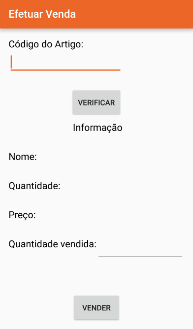

# GestStocks
Developed during my final project for the technical course in Management Informatics, this is an Android application designed to help small business managing their stock using Java as a language and SQLite as a database.
The users can interact with the app by buying and selling products and integrates the use of suppliers and warehouses. The application also integrates the use of different types of users.

**Administrator User:**
- Sell
- Buy
- Search by:
    - Code
    - Name
    - Warehouse
- List:
    - Products
    - Warehouses
    - Suppliers
    - Sales
    - Purchases
- Add Suppliers
- Add Warehouses
- Add Users

**Regular User:**
- Sell
- Buy
- Search by:
    - Code
    - Name
    - Warehouse
- List:
    - Products
    - Warehouses
    - Suppliers
    - Sales
    - Purchases

---

## Screens

**Splash Screen**

**Login Screen**

**Administrator Menu Screen**

**Regular Menu Screen**

**Sell Screen**

**Buy Screen**

**Search Screen**

**List Screen**

**Suppliers Screen**

**Warehouse Screen**

**Settings Screen**

